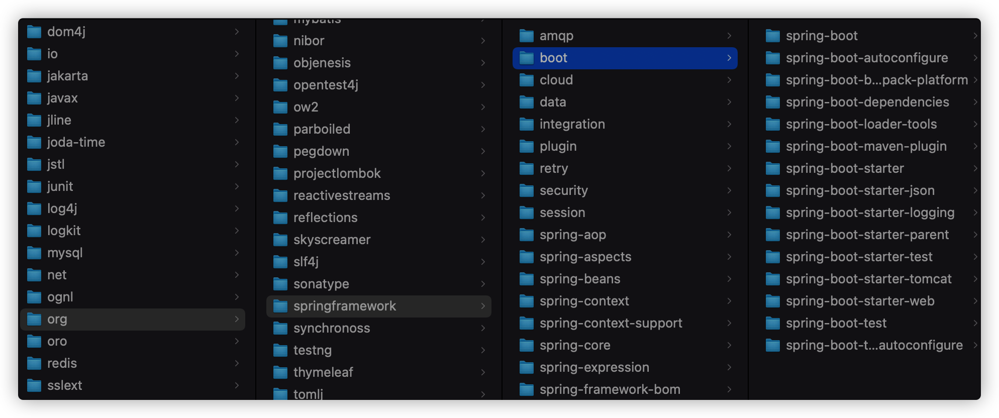

# 工程创建

## 1.1创建项目

https://blog.csdn.net/qq_43783527/article/details/124553251


### 1.1.1 大小写规范

- 项目名全部小写
- 包名全部小写

### 1.1.2 SpringBoot版次

SpringBoot3.0.0弃用Java8

### 1.1.3 找不到starter

Project 'org.springframework.boot:spring-boot-starter-parent:2.7.10' not found

- 检查报错的网址能否点开（配置阿里云镜像有没有这个版本的starter），发现有
- 查看IDEA中Maven的配置，地址配对了；
- https://blog.csdn.net/HeyWeCome/article/details/104543411 **阿里不再支持http下载**，只支持**https**。然后我还出现了一个问题，由于使用了HTTPS，存在着SSL证书验证的问题，因此我在IDEA中添加了一行配置：该配置用于忽略ssl证书的验证，（但是我还是报错）

```
-Dmaven.wagon.http.ssl.insecure=true -Dmaven.wagon.http.ssl.allowall=true
```


- 查看Maven仓库里面有没有引入



- 最后刷新清理缓存https://blog.csdn.net/m0_63410831/article/details/127276853


## 1.2 git

- 初始化本地仓库：菜单【VCS】---【Import into Version Control】---【Create Git Repository】
- 链接github：直接在IDEA创建GitHub仓库，并且链接到本地仓库

# 后台模块


# 前台模块