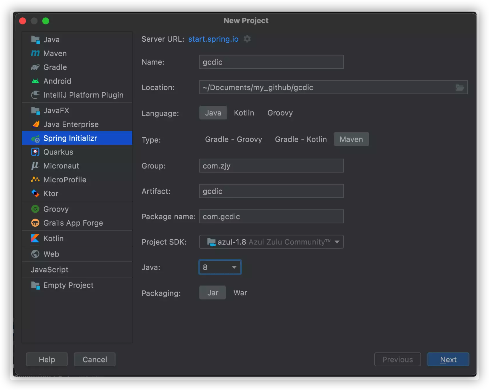

# 工程创建

## 1.1创建项目

https://blog.csdn.net/qq_43783527/article/details/124553251




### 1.1.1 大小写规范

- 项目名全部小写
- 包名全部小写

### 1.1.2 SpringBoot版次

SpringBoot3.0.0弃用Java8

### 1.1.3 找不到starter

Project 'org.springframework.boot:spring-boot-starter-parent:2.7.10' not found

- 检查报错的网址能否点开（配置阿里云镜像有没有这个版本的starter），发现有
- 查看IDEA中Maven的配置，地址配对了；
- https://blog.csdn.net/HeyWeCome/article/details/104543411 **阿里不再支持http下载**，只支持**https**。然后我还出现了一个问题，由于使用了HTTPS，存在着SSL证书验证的问题，因此我在IDEA中添加了一行配置：该配置用于忽略ssl证书的验证，（但是我还是报错）

```
-Dmaven.wagon.http.ssl.insecure=true -Dmaven.wagon.http.ssl.allowall=true
```


- 查看Maven仓库里面有没有引入


- 最后刷新清理缓存https://blog.csdn.net/m0_63410831/article/details/127276853


## 1.2 git

- 初始化本地仓库：菜单【VCS】---【Import into Version Control】---【Create Git Repository】
- 链接github：直接在IDEA创建GitHub仓库，并且链接到本地仓库

## 1.3 工程文件疑问


https://dandelioncloud.cn/article/details/1448821214910459906

https://blog.csdn.net/fuhanghang/article/details/108766128

https://blog.csdn.net/qq_46548855/article/details/128483767

https://blog.csdn.net/shouji6175/article/details/120364926

### .iml

- iml是 intellij idea的工程配置文件，里面是当前 project 的一些配置信息。

  IDEA中的`.iml`文件是项目标识文件，缺少了这个文件，IDEA就无法识别项目。跟[Eclipse](https://so.csdn.net/so/search?q=Eclipse&spm=1001.2101.3001.7020)的`.project`文件性质是一样的。并且这些文件不同的设备上的内容也会有差异，所以我们在管理项目的时候，`.project和.iml文件都需要忽略掉`。

  iml文件是IntelliJ IDEA自己创建的模块文件，用于java应用开发，存储一些模块相关的信息，比如一个Java组建，插件组建，[Maven](https://so.csdn.net/so/search?q=Maven&spm=1001.2101.3001.7020)组建等。存储一些模块路径信息，依赖信息以及别的一些设置。

- 删了程序重新导入后还会生成 但由于配置丢失可能会造成程序异常
- gitignore会忽略

### .idea

- .Idea 存放项目的配置信息，包括历史记录，版本控制信息等。根据用户本地的IntelliJ IDEA配置的生成，不同用户可能配置项不一样，所以一般在做版本控制的时候是把它排除在外，这样可以有效避免版本突。.idea/ 与当前项目能否正常执行无关，它只是负责对代码的历史变化进行一个记录，便于回溯查找和复原。
- gitignore会忽略

### mvn

- **mvnw** linux上处理mevan版本兼容问题的脚本（可删除 没影响）
- **mvnw.cmd** windows 上处理mevan版本兼容问题的脚本（可删除 没影响）


maven-wrapper解决了2个问题：

1. 可以为某个Java工程指定某个特定Maven版本，避免因为版本差异引起的诡异错误，这样就统一该项目的开发环境；
2. 不再需要提前安装Maven，简化了开发环境的配置；

## 1.4 引入依赖

### 1.4.1 mysql

起因：引入

```xml
<dependency>
    <groupId>mysql</groupId>
    <artifactId>mysql-connector-java</artifactId>
</dependency>
```

报错：For artifact {mysql:mysql-connector-java:null:jar}: The version cannot be empty.

思考：

奇了个怪，明明SpringBoot会指定版本，那为啥还说版本要指定

springboot项目mysql-connector-java默认版本查看方法:https://blog.csdn.net/zhangxianling11/article/details/102975473


解决：

https://blog.csdn.net/m0_63217468/article/details/129032585

最后发现**mysql-connector-java自8.0.31后更名为mysql-connector-j**了。

```xml
<dependency>
            <groupId>com.mysql</groupId>
            <artifactId>mysql-connector-j</artifactId>
 </dependency>
```

依赖还是找不到，手动加上版本，依据springbootParent提供的版本

### 1.4.2 mybatis-plus

- v3.5.3 支持spring-boot 2.7以上版本
- v3.5.3.1 紧急修改 lambdaQuery()...One() 实体不存在导致的 BUG

mybatis-plus 和 mybatis-plus-boot-starter

MyBatis-Plus是MyBatis框架的增强工具包，提供了许多实用的功能和工具，而MyBatis-Plus Boot Starter是MyBatis-Plus的Spring Boot集成组件，方便将MyBatis-Plus集成到Spring Boot项目中。

如果你使用了MyBatis-Plus Boot Starter，则不需要再引入MyBatis-Plus的依赖，因为MyBatis-Plus Boot Starter已经包含了MyBatis-Plus的依赖。只需要在pom.xml文件中引入MyBatis-Plus Boot Starter的依赖即可

### 1.4.3 Maven插件

```xml
<plugins>
<!-- java编译插件 黑马探花项目的 根pom -->
            <plugin>
                <groupId>org.apache.maven.plugins</groupId>
                <artifactId>maven-compiler-plugin</artifactId>
                <version>3.2</version>
                <configuration>
                    <source>1.8</source>
                    <target>1.8</target>
                    <encoding>UTF-8</encoding>
                </configuration>
            </plugin>

<!-- 黑马探花项目 提供服务的模块下  创建springboot自带-->
						<plugin>
                <groupId>org.springframework.boot</groupId>
                <artifactId>spring-boot-maven-plugin</artifactId>
            </plugin>
  </plugins>
```

不建议删除任何一个插件，因为它们都是在 Maven 构建过程中必要的插件，而且各自有不同的功能和用途。

`maven-compiler-plugin` 是 Maven 的核心插件，用于编译 Java 代码，如果删除该插件，Maven 无法编译 Java 代码生成 class 文件，从而无法继续构建应用程序。

`spring-boot-maven-plugin` 是 Spring Boot 的一个插件，用于构建和打包 Spring Boot 应用程序。如果删除该插件，Maven 无法将 Spring Boot 应用程序打包成可执行的 JAR 或 WAR 文件，从而无法部署和运行 Spring Boot 应用程序。

因此，建议保留并正确配置这两个插件，以确保 Maven 能够正确编译 Java 代码并打包 Spring Boot 应用程序。

### 1.4.4 SpringCloud依赖

在IDEA中使用Spring Initializr生成的Spring Boot项目默认情况下并不包含Spring Cloud相关的依赖，需要手动添加Spring Cloud的依赖。

依赖对应版本：Spring官网有

https://www.cnblogs.com/y3blogs/p/13263717.html

https://start.spring.io/actuator/info

### 1.4.5 Pom标签

#### 1.4.5.1 dependencyManagement

<dependencyManagement>是一个Maven POM文件中的元素，用于管理依赖的版本号和属性。它可以帮助团队中的所有开发者统一管理项目中使用的依赖版本，以及定义一些属性，如版本号、路径等。它并不直接引入任何依赖，而是提供了一种机制来统一指定依赖的版本，使得依赖的版本控制更加容易。

在<dependencyManagement>元素中，通常会定义一个或多个<dependency>元素，每个<dependency>元素指定了一个依赖的坐标（groupId、artifactId和version），并可以定义一些属性，如依赖的范围、类型、是否需要传递等。这样，在子模块中引用该依赖时，只需要指定坐标，而不需要指定版本号等详细信息，因为已经在父级的<dependencyManagement>中指定了。

#### 1.4.5.2 type pom

<type>pom</type>

在Maven中，pom类型的依赖通常用于管理其他项目的依赖关系和构建设置。这种类型的依赖通常被称为“父项目”或“聚合项目”，它们定义了一组共享的构建配置，以及一个或多个模块（子项目）的依赖关系。

#### 1.4.5.2 packaging pom

在父级项目中的pom.[xml](https://so.csdn.net/so/search?q=xml&spm=1001.2101.3001.7020)文件使用的packaging配置一定为pom。父级的pom文件只作项目的子模块的整合，在maven install时不会生成jar/war压缩包。

<packaging>pom</packaging>

#### 1.4.5.2 scope import

<scope>import</scope>

在一个父项目中，如果我们使用了<scope>import</scope>，那么子项目将会自动继承该父项目的依赖和构建配置，这大大简化了子项目的管理和维护。

----

后面索性复制tanhua工程的依赖以及对应的版本了

## 1.5 其他环境

Nacos

http://127.0.0.1:8848/nacos

Dubbo

http://localhost:38080/


### 1.5.1Dubbo demo

报错Failed to configure a DataSource: 'url' attribute is not specified and no embedded datasource could be configured.

Reason: Failed to determine a suitable driver class

- 小写random

   @DubboReference(version "2.0.0",retries 0,loadbalance "random")

- 增加exclude

  @SpringBootApplication(exclude=DataSourceAutoConfiguration.class)

# 后台模块


# 前台模块